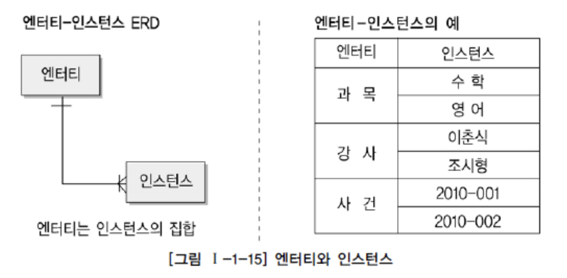

# SQL 개념 정리 - 엔터티

## 엔터티란?

엔터티 : 실체, 객체

명사이며, 업무상 관리가 필요한 관심사, 저장이 되기 위한 어떤 것을 지칭한다는 공통점

> "업무에 필요하고 유용한 정보를 저장하고 관리하기 위한 집합적인 것"

엔터티는 그 집합에 속하는 개체들의 특성을 설명할 수 있는 속성을 가짐

```text
"학생" = {학번, 이름, 이수학점, 등록일자, 생일, 주소, 전화번호, 전공..}
```

엔터티 인스턴스 전체가 공유 가능한 `공통 특성` / 일부에만 해당하는 `개별 속성`

엔터티는 인스턴스의 집합 < - > 인스턴스는 엔터티의 하나의 값



엔터티의 경우 대부분 사각형으로 표현

참고) 오브젝트 모델링 : 클래스 / 오브젝트 개념으로 클래스는 여러 개의 오브젝트를 포함

## 엔터티의 특징

1.  업무에서 필요로 하는 정보
   - 해당 업무에서 그 엔터티를 필요로 하는가를 판단하는 것이 중요
2.  식별이 가능해야 함
   - Unique Indentifier에 의해 식별이 가능해야 함
   - 해당 식별자가 두 개  이상의 엔터티를 대변할 경우 잘못 설계된 것
3.  인스턴스의 집합
    - 영속적으로 존재하는 인스턴스의 집합
    - 2개 이상의 인스턴스를 보유하지 않은 경우 엔터티라고 할 수 없음
4.  업무 프로세스에 의해 이용
    - 엔터티로 선택했지만 전혀 이용하지 않은 경우 업무 프로세스 도출이 적절하지 않았음을 의미
5.  속성을 포함
    - 속성이 존재하지 않는 오브젝트는 엔터티가 될 수 없음
6.  관계의 존재
    - 엔터티는 다른 엔터티와 최소 한 개 이상의 관계가 존재해야 함
    - 최소한 업무적 연관성을 가지고 다른 엔터티와의 연관의 의미를 가지고 있음을 나타냄
    - 그렇지 않다는 것은 적절한 관계를 찾지 못했거나 부적절한 엔터티라는 것
    - 다만, 통계나 코드적 필요에 의한 내부적 필요에 의한 엔터티 도출은 허용된다.

## 엔터티의 분류

1. 유무형에 따른 분류

   - 유형엔터티 (Tangible Entity)

     ```text
     물리적인 형태가 있고 안정적이며 지속적으로 활용되는 엔터티
     ```

   - 개념엔터티 (Conceptual Entity)

     ```text
     물리적인 형태는 존재하지 않고 관리해야 할 개념적 정보로 구분이 되는 엔터티
     ```

   - 사건엔터티 (Event Entity)

     ```text
     업무를 수행함에 따라서 발생하는 엔터티 ex) 주문, 청구, 미납..
     ```

2. 발생시점에 따른 분류

   - 기본 / 키 엔터티 (Key Entity)

     ```text
     그 업무에 원래 존재하는 정보, 독립적 생성이 가능, 타 엔터티의 부모 역할
     ```

   - 중심 엔터티 (Main Entity)

     ```text
     기본 엔터티로부터 발생, 업무에 있어서 중심적인 역할, 데이터 많이 발생, 관계를 통한 행위엔터티 생성
     ```

   - 행위 엔터티 (Active Entity)

     ```text
     두 개 이상의 부모엔터티로부터 발생되고 자주 내용이 바뀌거나 데이터양이 증가된다.
     분석 초기 단계에서 잘 나타나지 않으며 상세 설계 단계나 프로세스와 상관 모델링을 진행하면서 도출될 수 있다. ex) 주문목록, 사원변경이력
     ```

3. 스스로 생성될 수 있는지 여부에 따른 분류

   - 독립엔터티 / 의존엔터티

## 엔터티의 명명

1. 현업 업무에서 사용하는 용어 사용
2. 약어를 사용하지 않음
3. 단수 명사를 사용
4. 유일성
5. 생성 의미와 동일한 이름 부여
