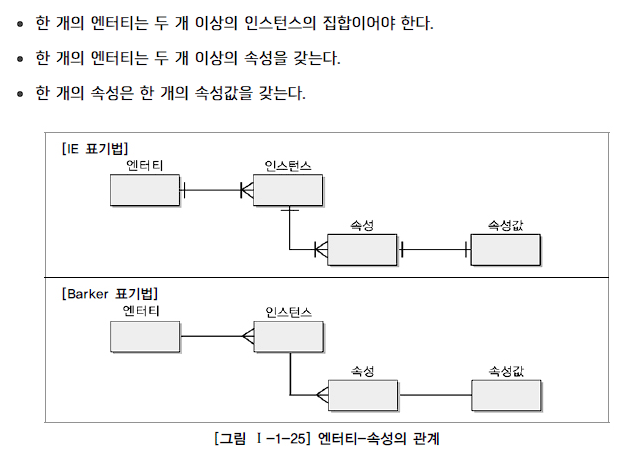
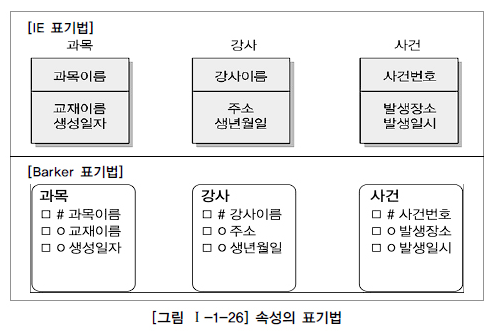

# SQL 개념 정리 - 속성

## 속성의 개념

1. 속성의 정의

   - 사전적인 의미

     ```text
     사물의 성질, 특징 또는 본질적인 성질
     ```

   - 데이터 모델링 관점

     ```text
     업무에서 필요로 하는 인스턴스로 관리하고자 하는 의미상 더 이상 분리되지 않는 최소의 데이터 단위
     ```

     - 생년월일: 해당 속성은 하나로서 의미가 존재
     - 이름주소: 하나의 속성이 2개의 의미를 가져 기본 속성이 될 수 없음

## 엔터티, 인스턴스와 속성, 속성값에 대한 내용 및 표기법

1. 엔터티, 인스턴스, 속성, 속성값의 관계

   

2. 표기법

   

## 속성의 특징

1. 엔터티와 마찬가지로 반드시 해당 업무에서 필요하고 관리하고자 하는 정보이어야 한다.
2. 정규화 이론에 근간하여 정해진 주식별자에 함수적 종속성을 가져야 한다.
3. 하나의 속성에는 한 개의 값만을 가진다. 하나의 속성에 여러 개의 값이 있는 다중값일 경우 별도의 엔터티를 이용하여 분리한다.

## 속성의 분류

1. 속성의 특성에 따른 분류

   - 기본속성

     ```text
     업무로부터 추출한 모든 속성
     ```

   - 설계속성

     ```text
     업무상 필요한 데이터 이외에 데이터 모델링을 위해, 업무를 규칙화하기 위해 속성을 새로 만들거나 변형하여 정의하는 속성
     ```

   - 파생속성

     ```text
     다른 속성에 영향을 받아 발생하는 속성, 보통 계산된 값들이 이에 해당
     ```

2. 엔터티 구성 방식에 따른 분류

   - PK(Primary Key) 속성

     ```text
     엔터티를 식별할 수 있는 속성
     ```

   - FK(Foreign Key)

     ```text
     다른 엔터티와의 관계에서 포함된 속성
     ```

   - 일반속성

     ```text
     PK와 FK가 아닌 미포함된 나머지 속성
     ```

## 도메인

각 속성의 가질 수 있는 값의 범위

엔터티 내에서 속성에 대한 데이터 타입과 크기, 제약사항을 지정

## 속성의 명명

1. 해당 업무에서 사용하는 이름: 현업에서 사용하는 이름 부여가 가장 중요
2. 서술식 속성명 사용하지 않음: 명사형을 이용하며 수식어를 많이 붙이지 않음
3. 약어 사용 제한: 의사소통과 시스템 운영의 원활함을 위해 약어 사용 지양
4. 전체 데이터 모델에서의 유일성 권장: 데이터에 대한 흐름을 파악하고 정합성을 유지하는 것에 큰 도움이 됨
