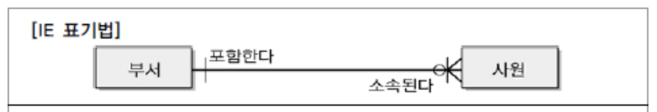
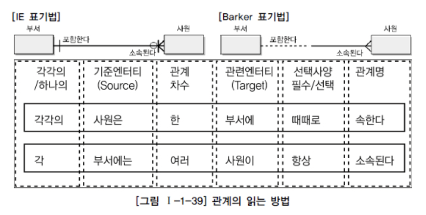

# SQL 개념 정리 - 관계

## 관계의 개념

1. 관계의 정의

   - 사전적 정의

     ```text
     상호 연관성이 있는 상태
     ```

   - 데이터 모델에서의 정의

     ```text
     엔터티의 인스턴스 사이의 논리적인 연관성으로서 존재의 형태로서나 행워로서 서로에게 연관성이 부여된 상태
     ```

2. 관계의 패어링 (paring)

   - 엔터티 내부 인스터스가 개별적 관계를 가지는 것

   - 따라서 각각의 개별 인스터스가 서로 다른 종류의 관계를 가질 경우 엔터티 사이 2개 이상의 관계 형성이 가능

   - 엔터티 내에 인스턴스와 인스턴스 사이 관계가 설정되어 있는 어커런스

     > 엔터티는 인스턴스의 집합을 논리적으로 표현
     >
     > 관계는 관계 패어링의 집합을 논리적으로 표현

   - 관계의 표현: 이항 관계 ~ n항 관계가 존재할 수 있으나 삼항 관계 이상은 잘 나타나지 않음

## 관계의 분류

1. 존재에 의한 관계 / 행위에 의한 관계
   - 연관 관계에 해당
   - 실선으로 표기
2.  행위에 의한 관계
   - 의존 관계에 해당
   - 점선으로 표기

## 관계의 표기법

- 관계명 (membership) : 관계의 이름

  - 엔터티가 관계에 참여하는 형태를 지칭

    > 관계시작점: 관계가 시작되는 편
    >
    > 관계끝점: 관계를 받는 편
    >
    > 참여자의 관점에 따라 관계 이름이 능동, 수동적으로 명명됨
    >
    > - 애매한 동사 배제
    > - 현재형으로 표현

- 관계차수 (cardinality) : 1:1, 1:m, m:n

  - 두 엔터티간 관계에서 참여자의 수를 표현하는 것

  - Crow's Foot 모델에서는 선을 이용하여 표현한다.

    

    위 그림과 같이 one 쪽은 발 하나로 표현되며, many 쪽은 발 여러개로 표현된 모습

  - m:n 관계로 표현된 모델의 경우 두 개의 주 식별자를 상속 받은 관계 엔터티를 이용하여 3개의 엔터티로 구분하여 표현

- 관계선택사양 (optionality)

  - 필수적인 관계
    - 지하철 출발 - 지하철 문닫힘의 관계처럼 필수적인 관계
    - 모든 참여자가 반드시 관계를 가지는, 타 엔터티의 참여자와 연결이 되어야 하는 관계
  - 선택적인 관계
    - 지하철 출발 - 지하철 안내방송의 관계처럼 정보가 관련은 있으나 필수적이지 않은 관계
  - 서로 관계가 항상 같지 않음
    - 주문과 목록의 관계의 경우: 목록은 주문서에 필수, 하지만 주문은 목록의 선택참여 요소 
  - 양쪽 모두 선택참여인 경우
    - 사실상 zero to zero의 관계, 관계 설정이 잘못되었는지 검토 필요

## 관계의 정의 및 읽는 방법

1. 관계 체크사항

   - 두 엔터티 사이 관심 있는 연관 규칙이 존재하는가?
   - 두 엔터티 사이 정보의 조합이 발생하는가?
   - 업무기술서, 장표에 관계연결에 대한 규칙이 서술되어 있는가?
   - 업무기술서, 장표에 관계연결을 가능하게 하는 동사가 있는가?

2. 관계 읽기

   - 기준 엔터티를 "1개 (one)"  또는 "각 (each)" 으로 읽는다.

   - 대상 엔터티의 관계참여 갯수를 읽는다.

   - 관계선택사항과 관계명을 읽는다.

     
