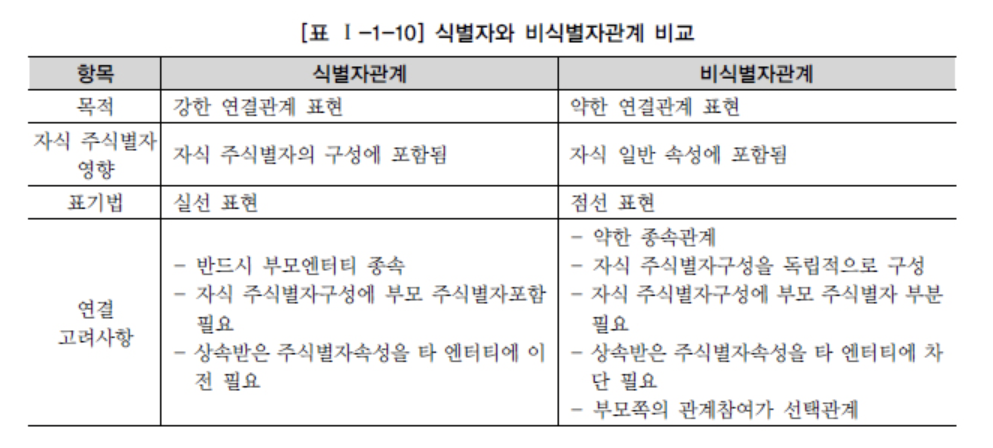

# SQL 개념 정리 - 식별자

## 식별자의 개념

1. 정의
   - 하나의 엔터티에 구성되어 있는 여러 개의 속성 중에 엔터티를 대표할 수 있는 속성을 의미
   - 하나의 엔터티는 반드시 하나의 유일한 식별자가 존재

2. Key와의 유사성
   - 식별자는 업무적으로 구분이 되는 정보 -> 논리 모델링 단계에서 사용
   - 키는 데이터베이스 테이블에 접근을 위한 매개체 -> 물리 데이터 모델링 단계에서 사용

## 식별자의 특징

1. 주 식별자일 경우
   - 주 식별자에 의해 엔터티 내의 모든 인스턴스들이 유일하게 구분되어야 함
   - 주 식별자를 구성하는 속성의 수는 유일성을 만족하는 최소의 수
   - 지정된 주 식별자의 값은 자주 변하지 않는 것이어야 함
   - 주 식별자가 지정된 경우 반드시 값이 들어와야 함
2. 대체 식별자일 경우
   - 주 식별자의 특징과 일치
3. 외부 식별자일 경우
   - 주 식별자의 특징과 일치하지 않음
   - 참조 무결성 제약조건에 따른 특징을 보유

## 식별자 분류 및 표기법

1. 식별자 분류
   - 자신의 엔터티 내에서 대표성을 가지는가?
     - 주 식별자: 타 엔터티와의 참조관계를 연결할 수 있는 식별자
     - 보조 식별자: 대표성을 가지지 못해 참조 관계 역할을 못하는 식별자
   - 엔터티 내에서 스스로 생성되었는가?
     - 내부 식별자: 엔터티 내부에서 스스로 만들어지는 식별자
     - 외부 식별자: 타 엔터티와의 관계를 통해 타 엔터티로부터 받아오는 식별자
   - 단일 속성으로 식별이 가능한가?
     - 단일 식별자: 하나의 속성으로 구성된 식별자
     - 복합 식별자: 둘 이상의 속성으로 구성된 식별자
   - 의미가 있는 식별자인가?
     - 본질 식별자: 업무에 의해 만들어진 식별자
     - 인조 식별자: 인위적으로 제작한 식별자, 구분 편의성 등을 고려한 일련번호 등이 여기 포함

2. 식별자 표기법

   

## 주 식별자 도출 기준

- 해당 업무에서 자주 이용되는 속성
- 명칭, 내역과 같은 이름으로 기술되는 것들 배제
- 주 식별자 복합 구성 시 너무 많은 속성이 포함되지 않도록 할 것

## 식별자 관계와 비식별자 관계에 따른 식별자

1. 식별자 관계와 비식별자 관계의 결정

   - 자식 쪽의 엔터티에 생성되는 속성: 외부 식별자, DB 생성 시 외래 키의 역할
   - 관계와 속성을 정의하고 주식별자를 정의하면 자연스럽게 외부 식별자가 도출
   - 엔터티에 주 식별자가 지정되고 엔터티간 관계 연계 시 부모 쪽의 주 식별자를 자식 엔터티의 속성으로 내려보낼 때 자식 엔터티에서는 해당 식별자를 주 식별자로 이용할 것인지, 연결 속성으로만 사용할 것인지를 결정해야 한다.

2. 식별자 관계

   - 자식 엔터티가 부모로부터 받은 식별자를 주 식별자로 이용하는 경우 
     - null 값이 오면 사용할 수 없으므로 반드시 부모 엔터티가 생성되어야 하는 자기 자신의 엔터티가 생성되는 경우를 말함
   - 1 : 1 관계
     - 부모로부터 받은 속성을 자식 엔터티가 모두 사용하고 그것만 사용할 경우
   - 1 : m 관계
     - 받은 속성을 포함하여 스스로 가지고 있는 속성과 함께 주 식별자로 구성하는 경우

3. 비식별자 관계

   - 부모로부터 속성을 받았지만 일반적인 속성으로만 사용하는 경우
     - 자식 엔터티에서 받은 속성이 반드시 필수가 아니어도 무방, 부모 없는 자식이 생성될 수 있는 경우
     - 엔터티 별로 데이터 Life Cycle을 다르게 관리할 경우
     - 여러 개의 엔터티가 하나의 엔터티로 통합되어 표현, 각각의 엔터티가 별도의 관계를 가질 경우
     - 주 식별자로 사용할 수도 있지만 별도의 주 식별자를 생성하는 것이 더 유리하다고 판단한 경우

4. 식별자 관계로만 설정할 경우의 문제점

   - 개발의 복잡성을 증가시키는 요인이 될 수 있음

5. 비식별자 관계로만 설정할 경우의 문제점

   - 데이터 모델링 전개 시 각 엔터티 간의 관계를 비식별자 관계로 설정한 경우 자식 엔터티로 상속이 되지 않아 자식 엔터티에서 데이터를 처리할 경우 부모 엔터티까지 찾아가야 하는 경우 발생

6. 식별자 관계와 비식별자 관계 모델링

   1. 비식별자 관계 선택 프로세스

      - 식별자 / 비식별자 관계를 취사선택하여 연결하는 기술 필요

        

   2. 식별자와 비식별자 관계 비교

      

   3. 식별자와 비식별자를 적용한 데이터 모델 예시

      
