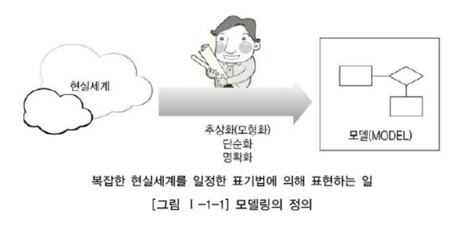
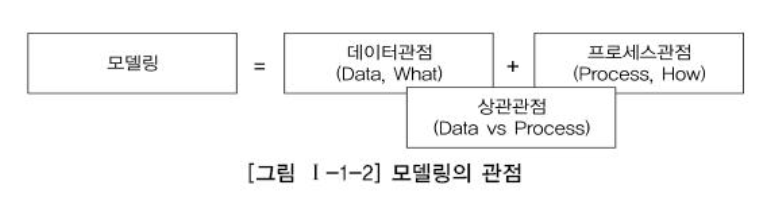
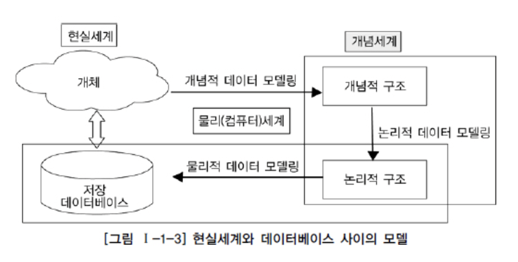
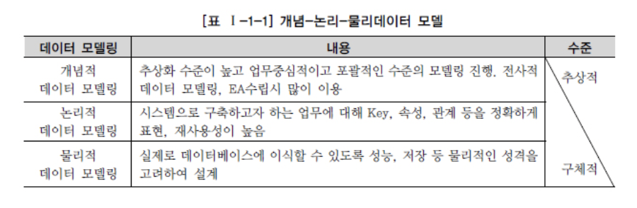
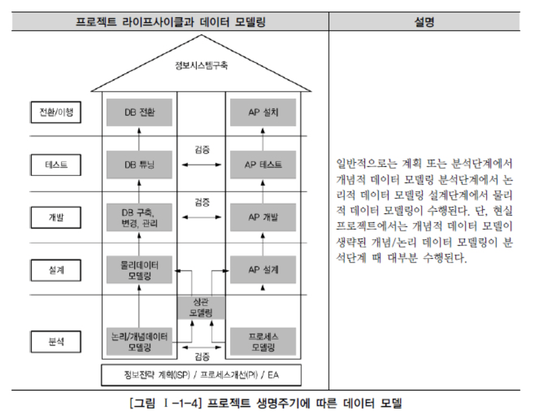

# SQL 개념 정리 - 데이터 모델의 이해

## 모델링의 정의

다양한 사전적 정의

- 가설적 또는 일정한 양식에 맞춘 표현

- 어떤 것에 대한 예비 표현으로 그로부터 최종 대상이 구축되도록 하는 계획으로서 기여하는 것

- 복잡한 "현실 세계" 를 단순화시켜 표현하는 것

- 모델이란 사물 또는 사건에  관한 양상이나 관점을 연관된 사람이나 그룹을 위하여 명확하게 하는 것

- 모델이란 현실 세계의 추상화된 반영

  

## 모델링의 특징

1. 특징의 요약

   - 추상화: 다양한 현상을 일정한 양식인 표기법에 의해 표현
   - 단순화: 복잡한 현실세계를 약속된 규약에 의해 제한된 표현으로 쉽게 이해할 수 있도록 함
   - 명확화: 누구나 이해하기 쉽도록 애매모호함을 제거하고 정확하게 현상을 기술

2. 재정의

   ```text
   현실세계를 추상화, 단순화, 명확화하기 위해 일정한 표기법에 의해 표현하는 기법
   ```

## 모델링의 3가지 관점

1. 데이터 관점
   - 업무가 어떤 데이터와 연관이 있는지 또는 데이터간의 관계는 무엇인지에 대해서 모델링
2. 프로세스 관점
   - 업무가 실제로 하고 있는 일은 무엇인지, 무엇을 해야 하는지를 모델링하는 방법
3. 상관 관점
   - 업무가 처리하는 일의 방법에 따라 데이터가 어떻게 영향을 받고 있는지 모델링하는 방법



## 데이터 모델의 기본 개념의 이해

1. 모델링의 정의
   - 데이터 모델은 DB의 골격을 이해하고 그 이해를 바탕으로 SQL 문장을 기능과 성능적인 측면에서 효율적으로 작성하기 위해 꼭 알아야 하는 핵심 요소
   - 정보 시스템을 구축하기 위해, 해당 업무에 어떤 데이터가 존재하는지, 업무가 필요로 하는 정보는 무엇인지를 분석하는 방법
   - 업무에 대한 종합적인 이해를 바탕으로 데이터에 존재하는 업무 규칙에 대해서 T / F를 판별할 수 있는 사실을 데이터에 접근하는 방법, 사람, 전산화와는 별개의 관점에서 이를 명확하게 표현할 수 있는 추상화 기법
2. 실무적 해석
   - 업무에서 필요로 하는 데이터를 시스템 구축 방법론에 의해 분석하고 설계하여 정보시스템을 구축하는 과정
   - 데이터 모델링을 하는 이유
     - 업무 정보를 구성하는 기초가 되는 정보들을 일정한 표기법에 의해 표현함으로써 정보시스템 구축의 대상이 되는 업무 내용을 정확하게 분석하는 것
     - 분석된 모델을 가지고 실제 데이터베이스를 생성하여 개발 및 데이터 관리에 사용하기 위한 것
   - 단지 데이터베이스를 구축하기 위한 용도로만 쓰이는 것이 아니라 데이터 모델링 자체로서 업루를 설명하고 분석하는 부분에도 매우 중요한 의미를 가지고 있음
3. 데이터 모델이 제공하는 기능
   - 시스템을 현재 또는 원하는 모습으로 가시화하도록 도움
   - 시스템의 구조와 행동을 명세화 할 수 있도록 함
   - 시스템을 구축하는 구조화된 틀을 제공
   - 시스템을 구축하는 과정에서 결정한 것을 문서화
   - 다양한 영역에 집중하기 위해 다른 영역의 세부 사항은 숨기는 다양한 관점을 제공
   - 특정 목표에 따라 구체화된 상세 수준의 표현 방법을 제공

## 데이터 모델링의 중요성 및 유의점

1. 파급효과 (Leverage)

   - 시스템의 테스트들이 어느 정도 수행된 시점에 데이터 구조의 변경이 발생할 경우, 다양한 영향 분석 결과에 영향을 미치게 되며, 해당 분야의 실제적인 변경 작업이 발생하게 된다. 그 영향 정도에 차이가 있겠으나 일련의 변경 작업은 시스템 구축 프로젝트에서 큰 위험요소가 될 수 있다. 따라서 데이터 설계 과정은 매우 중요하다고 할 수 있다.

2. 복잡한 정보 요구사항의 간결한 표현 (Conciseness)

   - 데이터 모델은 구축할 시스템의 정보 요구사항과 한계를 가장 명확하고 간결하게 표현할 수 있는 도구
   - 시스템을 구축하는 많은 관련자들이 설계자의 생각대로 정보요구사항을 이해하고 이를 운용할 수 있는 어플리케이션을 개발하고 데이터 정합성을 유지할 수 있도록 하는 것
   - 이상적인 역할을 할 수 있는 모델이 갖추어야 할 가장 중요한 점이 바로 정확성과 간결함

3. 데이터 품질 (Data Quality)

   - 데이터는 기업의 중요한 자산이며 기간이 길어질수록 활용가치는 훨씬 높아짐

   - 데이터의 정확도로 인해 비즈니스의 기회를 얻거나 잃을 수 있음

   - 데이터의 품질은 데이터 구조에서 비롯하므로 모델링 단계에서 고려해야 함

   - 유의점

     > 데이터의 정의와 데이터의 사용  프로세스를 분리할 것
     >
     > 데이터 간 상호 관계에 대해서 명확하게 정의할 것

     - 중복 (Duplication)
     - 비유연성 (Inflexibility)
     - 비일관성 (Inconsistency)

## 데이터 모델링의 3단계 진행

추상화 수준에 따라 개념적 데이터 모델, 논리적 데이터 모델, 물리적 데이터 모델로 정리





1. 개념적 데이터 모델링

   - 조직, 사용자의 데이터 요구사항을 찾아 분석
   - 핵심 엔터티와 그들 간의 관계 포착 및 표현 (엔터티 - 관계 다이어그램 생성)
   - 개념 데이터 모델은 사용자와 시스템 개발자가 데이터 요구 사항을 발견하는 것을 지원
   - 현재 시스템이 어떻게 변형되어야 하는가를 이해하는데 유용

   ```text
   참고)
   전사적 데이터 모델(Enterprise Data Model): 데이터 모델링이 전 조직에 걸쳐서 이루어진 모델
   ```

2. 논리적 데이터 모델링

   - 비즈니스 정보의 논리적인 구조와 규칙을 명확하게 표현하는 과정

   - 스키마 설계를 하기 전에 엑세스와 그러한 엑세스의 전산화와는 별개의 비즈니스 데이터에 존재하는 사실들을 인식하여 기록하는 것

   - 상세화 과정: 식별자 확정, 정규화, m : m 관계 해소, 참조 무결성 규칙 정의 등

   - "정규화"

     ```text
     논리 데이터 모델의 일관성을 확보하고 중복을 제거하여 속성들이 가장 적절한 엔터티에 배치되도록 하여 신뢰성 있는 데이터 구조를 확보하는 것
     ```

3. 물리적 데이터 모델링

   - 논리 데이터 모델이 어떻게 컴퓨터 하드웨어에 표현될 것인가
   - "물리적 스키마"
   - 물리적인 저장 구조, 사용될 저장 장치, 자료 추출을 위해 사용될 접근 방법

실제 현실 프로젝트에서는 3단계를 순차적으로 전부 수행하는 경우가 드물며 개념적 모델링과 논리적 모델링을 한 번에 수행하는 경우가 대부분이다.

## 프로젝트 Life Cycle에서 데이터 모델링

- waterfall 기반: 데이터 모델링의 위치가 분석과 설계 단계로 구분되어 명확하게 정의 가능

- 분석 단계 논리적 데이터 모델링 > 설계 단계 물리적 데이터 모델링

- 나선형 모델에서는 업무 크기에 따라 논리적 데이터 모델과 물리적 데이터 모델이 분석, 설계 단계 양 쪽에서 수행이 되며 비중은 분석 단계에서 논리적인 데이터 모델이 더 많이 수행되는 형태

  

- 데이터축과 애플리케이션축으로 구분, 각각 도출된 사항은 상호 검증을 지속적 수행, 완성도 높이는 과정
- 단, 객체 지향 개념은 데이터 + 프로세스 형태로 한 번에 모델링을 전개하므로 구분 없이 일체형으로 진행

## 데이터 모델링에서 데이터 독립성의 이해
